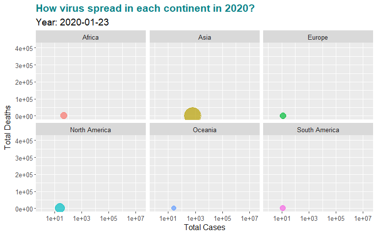

```{r setup, echo=FALSE, cache=FALSE}
library(knitr)
library(rmdformats)
## Global options
options(max.print="75")
opts_chunk$set(echo=FALSE,
	             cache=TRUE,
               prompt=FALSE,
               tidy=TRUE,
               comment=NA,
               message=FALSE,
               warning=FALSE)
opts_knit$set(width=75)
knitr::opts_chunk$set(echo = TRUE)
```


```{r echo=FALSE, warning = FALSE, comment=FALSE}
library(readr)
library(dplyr)
library(tidyverse)
library(gganimate)
library(gifski)
library(png)
library(gapminder)
library(DT)
```

## 1. Introduction and Objectives

In this project we will look at the Covid data from a different perspective. **We will analyze data with regards to world economy. We will look at different countries economic parameters and derive some insights.** Basically, we would like to answerd questions such as: which countries have more cases poor countries vs rich countries. We will also group countries by continent and look for patterns they may have. Also, we will show visualization that will tell story about covid and economy relationship. In the second part of the analysis, we will introduce foreign exchange rates and we will at it to derive insights. Our hypothesis is that, those countries who have more covid cases, their exchange rate should fall down and have some devaluation problems. We will also observe data for different continents and groups.  


## 2. Data Source

The data is located on GitHub and it is updated constantly by John Hopkins University. The data is directly sources from GitHub and we use live connecion. https://github.com/owid/covid-19-data/tree/master/public/data

Information about Confirmed cases and deaths comes from the COVID-19 Data Repository by the **Center for Systems Science and Engineering (CSSE) at Johns Hopkins University (JHU).**

Information about Hospitalizations and intensive care unit (ICU) admissions comes from the **European Centre for Disease Prevention and Control (ECDC)** for a select number of European countries; the government of the United Kingdom; the COVID Tracking Project for the United States; the COVID-19 Tracker for Canada. 

Information about Testing for COVID-19 is collected by the **Our World in Data** team from official reports;

Information about Vaccinations against COVID-19 is collected by the **Our World in Data** team from official reports.

The benefit of data is that it is constantly updated.


```{r warning = FALSE, comment=FALSE}
data <- read_csv("https://covid.ourworldindata.org/data/owid-covid-data.csv")

```

## 3. Data Description

Data contains `67,439` rows and `59` variables. Data is increasing since an observation is about one country data per day. Therefore, each day the data points are increasing. 

```{r}
glimpse(data)

```

The datatable sample is shown below.

```{r}
#data <- read.csv("owid-covid-data.csv", stringsAsFactors = F)
data$date <- as.Date(data$date, "%Y-%m-%d")
knitr::kable(data[1:5,])

```

## 4. Aggregating Data

We will select only important colums such as `location`, `continent`, `gdp_per_capita`, `population_density`, `total_cases`, `total_cases_per_million`, `population`. This is to use wisely our computation memory and derive useful insights in our graphs. Next step is to remove **World** and **International** from the dataset since we will concentrace on countries and those files will be outliers in the graphs. 

```{r}
library(dplyr)
temp <- data.frame(data) %>% dplyr::select(location, continent, gdp_per_capita,
                                    population_density, total_cases, 
                                    total_cases_per_million, population)

temp[is.na(temp)] <- 0

temp <- subset(temp, location!="World" & location!="International")
data_agg <- temp %>% group_by(location, continent) %>% 
  summarise(total_cases = max(total_cases), gdp_per_capita = max(gdp_per_capita),
            population_density = max(population_density), 
            total_cases_per_million = max(total_cases_per_million),
            population = max(population))


knitr::kable(data_agg[1:10,], capture = "Dataset first 10 records")

```


## 5. Distribution

Let's start out analysis with distributions. First of all, let's observe the distribution of the `GDP_per_capita`. On the graph we see that the distribution is skewed on the right. The majority of countries have less than 20.000 USD GDP per Capita. Which means that the world has much more poor countries than rich.

```{r}
library(ggplot2)
library(scales)

ggplot(data_agg, aes(x=gdp_per_capita))+
  geom_histogram(aes(y=..density..), colour="black", fill="white") +
  geom_density(color="darkblue", fill="#E69F00", alpha=0.7) +
  labs(title = 'What is the Distribution of GDP per capita?',
       subtitle = 'Right-skewed distribution, many poor countries') + 
  theme(plot.title = element_text(size = 16, color = "#0B8389", face = "bold"),
        plot.subtitle = element_text(size = 11)) +
   scale_y_continuous(labels = comma) + 
    scale_x_continuous(labels = comma)


```

## 6. Grouping Countries by Income

Let's group coutnries in three countries and observe how many countries we have in each group. We will use `GDP_per_capita` to define the groups rich, medium and poort countries. Countries between *0-7.000* USD `GDP_per_capita` we call this group "poor". The countries with `GDP_per_capita` between *7.000-20.000* USD, we call them "medium" income countries. And the thirds group is countries with `GDP_per_capita` more than *20.000* USD. 

Looking at the graph we see that 40 countries in Africa are in poor countries categories. We definitely do not want the world to have that many poor countries and especially in one continent. The Europe is the continent with many rich countries and only one poor country which is *Moldova*. North and South America have many Medium income countries. However, our desire is to have evenly distributed wealth in every continent and countries. 


```{r}
library(DT)
data_agg$gdp_per_capita_group <- cut(data_agg$gdp_per_capita, breaks=c(0,7000,20000,40000), include.lowest = FALSE, dig.lab = 6)


data_for_dist.a <- data_agg %>% group_by(continent) %>% dplyr::count(gdp_per_capita_group)
data_for_dist.a <-  na.omit(data_for_dist.a)

#datatable(head(data_for_dist.a), caption = 'Distribution of countries by GDP_per_capita groups & continents')

wrapper <- function(x, ...) 
{
  paste(strwrap(x, ...), collapse = "\n")
}

ggplot(data_for_dist.a, aes(x = continent, y = gdp_per_capita_group)) + 
  geom_tile(aes(fill = n), color = 'white', show.legend = F) +
  theme_minimal() + 
  geom_text(aes(label = n), size = 5, fontface = 'bold', color = 'white') +
  scale_fill_gradient(low = '#6bb0c4', high = '#dd5f64') +
  theme(panel.grid = element_blank(),
        plot.title = element_text(size = 16, color = "#0B8389", face = "bold"),
        plot.subtitle = element_text(size = 11),
        axis.text.y = element_text(size = 10),
        axis.text.x = element_text(size = 10)) +
  ggtitle(wrapper("Distribution of countries by GDP_per_capita groups & continents", width = 60)) +
  labs(subtitle = wrapper('Moldova in Europe and Bolivia in South America only countries with less than $7,000 GDP_per_capita', width=80))


```

## 7.  Rich vs Poor Countries & Covid Cases

Looking at the below graph we want to answer question, **Do rich countries have more covid cases?** Graph answers that questions as this is true assumptions - rich countries have more covid cases. We think this is due to the fact the in rich countries population is tested massively and also statistic is kept more accurate to count cases than comparing with poor countries. The poor countries do not count cases successfully and even more critical is that they do not test the population as the test are not available for most of them.


```{r warning = FALSE, message = FALSE}
library(plotly)
library(ggrepel)

data_agg$population_mln <- as.numeric(data_agg$population/1000000)
ggplot(data_agg, aes(x = total_cases, y = gdp_per_capita, color = continent, 
                 size = population_mln)) +
  geom_point(alpha=0.5) +
    labs(x = 'Total Cases',
       y = 'GDP per capita',
       title = "Where are European countries on the scatterplot?",
       subtitle = "Just on the top-right, behind the US!",
       caption = 'Date: 2021-Jan-29') +
  theme(panel.background = element_rect(fill = 'white', color = 'white', size = 1.2),
        plot.background = element_rect(fill = 'white'),
        plot.title = element_text(size =16, face='bold', 
                                  color = '#0B8389'),
        plot.subtitle = element_text(size = 11),
        plot.caption = element_text(face = 'italic', size = 8),
        panel.grid.major = element_line(linetype = 'dashed', size =0.1),
        panel.grid.minor = element_blank(),
        axis.text.y = element_text(size = 10),
        axis.text.x = element_text(size = 10),
        legend.position = "bottom") +
  scale_x_continuous(trans = "log10", labels = comma)+
  scale_y_continuous(trans = "log10", labels = comma) + 
  scale_size(range = c(.1, 20), name="Population [mln]") +
  guides(color = guide_legend(override.aes = list(size = 6))) 


#ggplotly(a)
```


## 8. Heatmap of I and II Wave of Covid

Below heatmap shows monthly new covid cases for European countries. **The Heatmap gives us good demonstration when we have first and the second waves of the corona virus cases spikes**. The colors are based on the covid cases. The dark red is a lot of cases while yeallow whiteish is less cases. In the first wave Spain, Italy, Germany and France has a lot of case during March and April in 2020. While during the second wave we see a lot of redish cells during October 2020 and January 2021, especially in the countries such as Spain, Italy, Poland, Germany, France, Belgium and the Netherlands. 

```{r}
library(lubridate)
library(dplyr)

EU <- c("Austria", "Belgium", "Bulgaria", "Croatia", "Cyprus",
        "Czech Republic", "Denmark", "Estonia", "Finland", "France",
        "Germany", "Greece", "Hungary", "Ireland", "Italy", "Latvia",
        "Lithuania", "Luxembourg", "Malta", "Netherlands", "Poland",
        "Portugal", "Romania", "Slovakia", "Slovenia", "Spain", "Sweden")


data_for_month <- data.frame(data) %>% dplyr::select(location, date, new_cases) %>% 
  filter(location %in% EU)
data <- data.frame(data)

datats <- data.frame(data) %>% dplyr::select(continent, date, total_cases)


data_for_month$month <- floor_date(data_for_month$date, "month")

data_for_month <- as.tibble(data_for_month) %>%
  group_by(location, month) %>%
  summarize(new_cases = as.numeric(sum(new_cases))) 

data_for_month$month<-as.character(data_for_month$month)
data_for_month$new_cases_1000 <- as.numeric(data_for_month$new_cases/1000)
ggplot(data_for_month, aes(month, location)) + 
  geom_tile(aes(fill = new_cases_1000), colour = "white") + 
  labs(title = "Which month had the biggest amount of new cases?",
       subtitle = "First wave in Mar 2020 and the second wave in Sep-Oct 2020!",
       caption = 'Date: 2021-Jan-29') +
  scale_x_discrete("", expand = c(0, 0)) + 
  scale_y_discrete("", expand = c(0, 0)) + 
  scale_fill_gradient2(name= "New Cases 000'",low = "#006400", mid = "#f2f6c3", high = "#cd0000", 
                       midpoint = 0.5, na.value = "white")+
  theme(legend.position = "right",
        axis.ticks = element_blank(), 
        axis.text.x = element_text(angle = 90, hjust = 0.5),
        axis.text.y = element_text(size = 10),
        panel.background = element_blank(),
         plot.title = element_text(size =16, face='bold', 
                                  color = '#0B8389'),
        plot.subtitle = element_text(size = 11))


```


## 9. Top 15 Countries by Covid Cases

Let's observe top 15 countries to see if covid cases are **concentrated on one continent or it is spread evenly**. Looking at the chart of top 15 countries we can see that only one country is from Africa, country - South Africa. This tells us again a story that rich countries are able to test and count the covid cases well. South Africa is richest country in Africa.

The majory of countries in Top 15 are located in Europe. 7 countries out of 15 are european countries. 

Two countries are from North America - United States and Mexico. While South America is represented by three countries, they obviously have the biggest population in the continet. They are Brazil, Colombia and Argentina.

One country from Middle East - Turkey and one country from Asia - India. 

```{r warning = FALSE}
new_data_agg <- data_agg[order(-data_agg$total_cases),]
new_data_agg$total_cases_mln <- as.numeric(new_data_agg$total_cases/1000000)
new_data_agg <- new_data_agg[1:15,]
ggplot(data=new_data_agg, aes(x= total_cases_mln, y = reorder(location, total_cases_mln), fill=continent)) +
  geom_bar(width = 0.8, stat = 'identity') +
  labs(title = 'Which are top 15 countries by Total Cases?',
       subtitle = "USA, India & Brazil combines 45% of World's Total Cases",
       caption = 'Date: 2021-Jan-29') + 
  xlab('Total Cases [mln]') +
  ylab('Countries') +
  theme(legend.position = "right",
        text = element_text(size=12),
        axis.text.y = element_text(hjust=1),
        plot.caption = element_text(face = 'italic', size = 8),
        plot.title = element_text(size =16, face='bold', 
                                  color = '#0B8389'),
        plot.subtitle = element_text(size = 11)) +
  scale_fill_discrete(name = "Continent") +
  geom_text(aes(label = round(total_cases_mln,3)), vjust =0.5, hjust=-0.03, 
            color = 'darkgreen', size = 3.5) +
  scale_fill_brewer(palette="Paired")

```

## 10. Covid in Rich Countries

The special scatterplot below is dedicated to answer one question - **do mostly rich countries getting infected with virus?** With one look the answer is positive, yes, the more `GDP_per_capita` the more `total_cases_per_million`. For example, Luxembourg, Qatar and Singapore are top three countries with highest `GDP_per_capita`, however, they are also on the top of the `total_cases_per_million`.

Green balls on the top-right represent European countries and they are certainly on the top of the scatter plot by both metrics `GDP_per_capita` and `total_cases_per_million`. Contrary, African countries in red are way below in both metrics.


```{r}
library(ggiraph)
library(ggplot2)
library(ggrepel)
# Basic plot: 
data_agg_n <- data_agg %>% filter(gdp_per_capita > 10 & total_cases_per_million > 10)

g <- ggplot(data_agg_n, 
            aes(x = gdp_per_capita, y = total_cases_per_million, color = continent)) +
 geom_text_repel(
   data = subset(data_agg_n, gdp_per_capita > 72000),
   aes(label = location),
   size  = 5,
   box.padding = unit(0.35, "lines"),
    point.padding = unit(0.3, "lines"), 
   nudge_x = 0.8, nudge_y = 1.5, direction = "y", hjust = "left",
   segment.curvature = -0.1,
    segment.ncp = 3,
    segment.angle = 20)+
  geom_point() +
  labs(title = 'How is covid situation in rich countries?',
       subtitle = "Europe cluster on the right-top while Africa cluster on the left bottom",
       caption = 'Date: 2021-Jan-29') +
  scale_x_continuous(trans = "log10", expand = expansion(mult = 0.5), labels = comma) +
  scale_y_continuous(trans = "log10", labels = comma) +
  theme(legend.position = "bottom",
        text = element_text(size=12),
        plot.caption = element_text(face = 'italic', size = 8),
        plot.title = element_text(size =16, face='bold', 
                                  color = '#0B8389'),
        plot.subtitle = element_text(size = 11)) +
        coord_cartesian(clip = "off") +
  guides(color = guide_legend(override.aes = list(size = 6)))

# Interactiveness:
g_int <- g + geom_point_interactive(aes(tooltip = location), size = 3)

# Wyświetlenie
ggiraph(code = print(g_int))

  #geom_label_repel(aes(gdp_per_capita, total_cases_per_million, fill=continent,
   #                   label = location))

```

## 11. Distribution of Wealth by Continents

**Does equlity exist between countries in different continents?** Let's study the below histograms. The Europe is more or less normally distributed which is desirable for all other continents, but are the same distribution of `GDP_per_capita` on different continents? 

Africa is mostly on the left side, many poor countries just with small amoount of `GDP_per_capita`.

Asia, less but North America and South America is more or less normally distributed, however, North America and Asia have outlires such as the United States, Canada, Singapore and Hong Kong.


```{r warning=FALSE}
ggplot(data_agg, aes(x = gdp_per_capita, fill = continent)) + 
  geom_histogram(data = data_agg[,-5], alpha = .5, bins = 30, colour = "black") + 
   labs(title = 'Which continents have similar distribution of GDP_per_capita?',
       subtitle = "Africa and Asia very much right-skewed",
       caption = 'Date: 2021-Jan-29') +
  facet_wrap(~ continent) + guides(fill = FALSE) + 
  theme(axis.text.x = element_text(colour = "grey20", size = 10, 
                                   angle = 90, hjust = 0.5, vjust = 0.5),
        axis.text.y = element_text(colour = "grey20", size = 10),
        text = element_text(size=12),
        plot.caption = element_text(face = 'italic', size = 8),
        plot.title = element_text(size =16, face='bold', 
                                  color = '#0B8389'),
        plot.subtitle = element_text(size = 11)) +
  scale_y_continuous(labels = comma) + 
    scale_x_continuous(labels = comma)


#ggplotly(b)
```

```{r}
data_sel <- data.frame(data) %>% dplyr::select(continent, location, date, new_cases, 
                                        new_deaths, total_cases, total_deaths,
                                        total_cases_per_million, population)

knitr::kable(data_sel[1:5,])


```

## 12. Development of Covid Cases

The racing chart below shows how covid cases were increasing in different continets from the start until now.

The figures show **total deaths** on the left side and **total cases** on the right side. 

In Asia, India started quite late but it is leading now with the number of covid cases. 

In Europe, countries start ver quick on covid cases but fortunately do not climb up on the total deaths axis.

Unfortunately, in US the total deaths side is climbed by the United States and in South America Brazil is following the US trend.


```{r message = FALSE, warning = FALSE, results = FALSE}
#data_anim <- data_sel %>% filter(location %in% c("Germany","Canada", "Mexico", 
#                                                 "Italy", "Spain", "Poland"))

data_anim <- data_sel %>%
  filter(continent %in% c("Africa", "Asia", "Europe", "North America",
                          "South America", "Oceania"))
data_anim <- data_anim[complete.cases(data_anim),]
gifplot <- ggplot(data_anim, aes(total_cases, total_deaths,
                     size = population, colour = continent)) +
  geom_point(alpha = 0.7, show.legend = FALSE) +
  scale_size(range = c(2, 12)) +
  scale_x_log10() +
  facet_wrap(~continent) +
  # Here comes the gganimate specific bits
  labs(title = 'How virus spread in each continent in 2020?', 
       subtitle = 'Year: {frame_time}', x = 'Total Cases', y = 'Total Deaths') +
  transition_time(date) +
  ease_aes('linear') +
  shadow_wake(wake_length = 0.1, alpha = FALSE) + 
  shadow_mark(alpha = 0.3, size = 0.5) + 
  theme(text = element_text(size=12),
        plot.title = element_text(size =16, face='bold', 
                                  color = '#0B8389'),
        plot.subtitle = element_text(size = 14))
  

gganimate::animate(gifplot, duration = 15, fps = 20, renderer = gifski_renderer())
anim_save("gifplot.gif")

```



## 13. World Map

The map represents countries coloured by `GDP_per_capita`. Darker the color bigger the `GDP_per_capita`. Th North America, Europe and Australia is mostly dark coloured since their high `GDP_per_capita`.

Map is interactive and when you hover the country it displays the information about `GDP_per_capita`, `Total cases`, `Cases per million`, `population`.


```{r}
library(tidyverse)
library(rnaturalearth)
library(cowplot)
library(sf)
library(ggmap)
library(leaflet)
library("rnaturalearth")
library("rnaturalearthdata")
library("sf")
library("rgeos")
library(tidyverse)
library(ggplot2)
library(readr)
library(maps)
library(viridis)
library(plotly)

theme_set(theme_bw())

world <- ne_countries(scale = "medium", returnclass = "sf")
world <- data.frame(world)
world <- world %>% dplyr::rename(location = name)

worldmap <- world %>% dplyr::select(location, adm0_a3) 
worldmap1 <- merge(x=worldmap, y=data_agg, by="location", all.x = TRUE)
fig <- plot_ly(worldmap1, type='choropleth', locations=worldmap1$adm0_a3, z=worldmap1$gdp_per_capita, colors="PuBuGn" ,
               hoverinfo = 'text',
        text = ~paste('</br> Country: ', worldmap1$location,
                      '</br> GDP_per_capita: ', round(worldmap1$gdp_per_capita,0),
                      '</br> Total Cases: ', worldmap1$total_cases,
                      '</br> Cases per mln: ', round(worldmap1$total_cases_per_million,3),
                      '</br> Population mln: ', round(worldmap1$population_mln,3))) %>% 
  layout(title = 'All information about Countries, coloured according to GDP_per_capita', size = 16,
         face = 'bold', color= '#0B8389', 
         legend=list(title=list(text='<b> GDP_per_capita </b>'), orientation = 'h'))

fig
#library(htmlwidgets)

#saveWidget(fig, "index.html")

```


```{r}


library(ggplot2)
library(ggcorrplot)
library(tidyverse)
library(lubridate) 
library(ggplot2)
library(readxl)
library(gganimate)
library(ggthemes)
library(MASS) 
library(reshape2) 
library(reshape) 
library(DescTools)
library(dplyr)
library(stats)
options(scipen=999)


exchange_rate_euro <- read.csv("eurofxref-hist.csv", stringsAsFactors=FALSE)
exchange_rate_euro <- exchange_rate_euro[,c(1:42)]
exchange_rate_euro[,c(2:42)] <- lapply(exchange_rate_euro[,c(2:42)],as.numeric)
exchange_rate_euro[is.na(exchange_rate_euro)] = 0

exchange_rate_euro[,1] <- as.Date(exchange_rate_euro[,1], "%Y-%m-%d")
exchange_rate_euro <- exchange_rate_euro %>% filter( Date >= as.Date("2020-01-01"))
df2 <- melt(exchange_rate_euro, id = c("Date")) 
colnames(df2)[2:3]<-c("Currency", "Exchange_rate")
df <- df2[df2$Currency %in% c("USD"),]
head(df)

```

```{r}

currency_vs_country <- read.csv("tableconvert_csv_9gbdx9.csv")
colnames(currency_vs_country)[1]<-"Country"
temp1<- merge(x=data_sel, y=currency_vs_country, by.x = "location", by.y = "Country" , all.x = TRUE)
temp2<-merge(x=temp1, y=df2, by.x= c("Code","date"), by.y=c("Currency", "Date"), all.x = TRUE)
temp2 <- temp2[complete.cases(temp2), ]
temp2 <- temp2[temp2$Exchange_rate < 100,]


temp3 <- temp2 %>%
    group_by(date, continent) %>% dplyr::summarize(Mean_ex = mean(Exchange_rate, na.rm=TRUE),  cases_pm= sum(new_cases)/max(population))
#temp4 <- melt(temp3, measure.vars =c("Mean_ex", "Mean_ex"))
data_sub2 <- temp3 %>% filter(continent %in% c("Africa", "Asia", "Europe", "North America", 
    "South America", "Oceania"))
#data_sub2 <- temp3 %>% filter(continent %in% c( "Europe"))

#data_sub2 <- data_sub2[data_sub2$Mean < 100,]

head(data_sub2)
```

```{r}
library(hrbrthemes)
library(viridis)
library(ggplot2)
library(gganimate)
library(babynames)
library(ggrepel)

plot1 <- data_sub2 %>%
  ggplot( aes(x=date, y=`Mean_ex`, group=continent, color=continent)) +
    geom_line() +
    geom_point() +
    geom_label_repel(aes(label = continent),
                  nudge_x = 1,
                  na.rm = TRUE)+
    scale_color_viridis(discrete = TRUE) +
    labs(title="Exchange Rate Trend by Continent",
        x = "Date", y = "Exchange Rate") +
    theme(legend.position = "none",
          text = element_text(size=12),
          plot.title = element_text(size =16, face='bold', 
                                  color = '#0B8389')) +
    transition_reveal(date)
plot1 
anim_save("plot1.gif")


```


```{r}
library(ggrepel)

plot2 <- data_sub2 %>%
  ggplot( aes(x=date, y=cases_pm, group=continent, color=continent), show.Legend =FALSE) +
    geom_line() +
    geom_point() +
    geom_label_repel(aes(label = continent),
                  nudge_x = 1,
                  na.rm = TRUE)+
    scale_color_viridis(discrete = TRUE) +
    labs(title = "Covid Cases per Capita Trend",
         x = "Date", y = "Covid Cases per Capita") +
    theme(legend.position = "none",
          text = element_text(size=12),
          plot.title = element_text(size =16, face='bold', 
                                  color = '#0B8389')) +
    transition_reveal(date)


gganimate::animate(plot2, duration = 20, fps = 20, renderer = gifski_renderer())

anim_save("plot2.gif")

```


```{r results="hide", fig.show="hide"}
options(width = 800)
library(treemap)
library(htmlwidgets)
#devtools::install_github("timelyportfolio/d3treeR")
library(d3treeR)

tree_df <- temp2 %>% group_by(continent, location) %>% mutate(Norm = Exchange_rate/max(Exchange_rate)) %>% dplyr::select(continent, location, Norm)
tree_df <- data.frame(tree_df)

World <- treemap(tree_df,
            index=c("continent","location","Norm"),
            vSize="Norm",
            type="index",
            palette = "Set3",
            bg.labels=c("white"),
            align.labels=list(
              c("center", "center"), 
              c("right", "bottom")
            )  
          )            

# make it interactive ("rootname" becomes the title of the plot):
inter <- d3tree3(World)

# save the widget
# library(htmlwidgets)
saveWidget(inter, file=paste0( getwd(), "/interactiveTreemap.html"))
```


```{r set-options, echo=FALSE}
htmltools::includeHTML("interactiveTreemap.html")

options(width = 800)


```


```{r, warning=FALSE}

#library(broom.mixed)
library(jtools)
library(arm)
library(dplyr)


dat <- data [,c("continent",  "date","location",
                                        "total_cases_per_million", "population", "gdp_per_capita", "stringency_index", "median_age","human_development_index")]

join1<- merge(x=dat, y=currency_vs_country, by.x = "location", by.y = "Country" , all.x = TRUE)
join2<-merge(x=join1, y=df2, by.x= c("Code","date"), by.y=c("Currency", "Date"), all.x = TRUE)

join2 <- join2[complete.cases(join2), ]
head(join2)
join2 <- join2 %>% group_by(continent, location) %>% mutate(Norm = Exchange_rate/max(Exchange_rate))
reg_df <- join2 %>% group_by(continent, location) %>% mutate(Norm_cases =total_cases_per_million/max(total_cases_per_million))
reg_df <- reg_df [,!(colnames(reg_df) %in% c("CountryCode","Code","location","total_cases_per_million","date"))]
reg_df <- na.omit(reg_df)
#reg_df$date<-as.character(reg_df$date)

#reg_df <- reg_df [,c("date","location", "continent", "Norm","Norm_cases")]
head(reg_df,30)
```

```{r}
library(moonBook)
library(jtools)


Reg2 <- lm(formula = Norm ~ Norm_cases + continent , data = reg_df, intercept =FALSE)
#Reg2$pred
summ(Reg2 , exp = TRUE)
```


```{r}

check <- data.frame(summary(Reg2)$coef[summary(Reg2)$coef[,4] <= .001, 4])
check <- cbind(Variables = rownames(check), check)
rownames(check) <- 1:nrow(check)
colnames(check)[2] <- "P_Value"
check <- na.omit(check)
check <-check[order(check$P_Value),]
#heck$P_Value <- round(check$P_Value,digits = 3)


p <- ggplot(Reg2, aes_string(x = names(Reg2$model)[2], y = names(Reg2$model)[3], color = names(Reg2$model)[1])) +
  geom_col()+
  scale_fill_distiller(palette = "Reds", direction = 1) +
  guides(col=guide_legend("Exchange Rate"))+
  ggtitle("How does Exchange Rate differ in a Continent with given no. of Covid Cases?") +
  #geom_text(aes(label=formatC(P_Value, format = "f", digits =7))) +
  theme_minimal() +
  xlab("Covid Cases")+
  ylab("Continent")+
  coord_flip()+
  theme(
    panel.grid = element_blank(),
    panel.grid.major.y = element_line(color = "white"),
    panel.ontop = TRUE
  )

p+transition_states(continent, wrap = FALSE) +
  shadow_mark() +
  enter_grow() +
  enter_fade()
anim_save("plot3.gif")
```


```{r}
library(sandwich)
#plot_summs(Reg)
ggplotly(effect_plot(Reg2, pred = Norm_cases, interval = TRUE, colors = "purple", x.label = "Covid Cases", y.label = "Exchange rate", robust = "HC0", main.title = "Actuals versus Predicted"))

```


```{r}
ggplotRegression <- function (Reg) {

require(ggplot2)
require(ggthemes)

ggplot(Reg$model, aes_string(x = names(Reg$model)[2], y = names(Reg$model)[1], color = names(Reg$model)[3])) + 
  geom_point() +
  ggtitle("Fit of the model") +
  theme(plot.title = element_text(hjust = 0.5))+
  xlab("Covid Cases") + 
  ylab("Exchange Rate")+
  guides(col=guide_legend("Continents"))+
  stat_smooth(method = "lm", col = "red") +
  labs( subtitle = paste("Adj R2 = ",signif(summary(Reg)$adj.r.squared, 5),
                     "Intercept =",signif(Reg$coef[[1]],5 ),
                     " Slope =",signif(Reg$coef[[2]], 5),
                     " P =",round(summary(Reg)$coef[2,4], 2)))
}
ggplotRegression(Reg2)


```


## Conclusion

In this project we **analyzed different datasets** such as **Covid Cases by country and date**, **economic parameters by country**, **foreign exchange rates for different countries**. We specifically observed **rich** countries vs **poor** countries and how the covid developed in each group of countries. We also look at the data by different continents to see the patterns.

We used the advanced visualizations to see the trends, histograms, scatterplots, animated graps to see the insights better than we could derive from the dry tables with only numbers. After running visualizations it is obvious that patterns are much better visible than what we could see without visualizations. 

One of the clear insights after analysis is that **countries from rich group have more covid cases**, this can be explained by different factors: `1. They are able to run testing for their population. 2. They are capable to count the covid cases`. Contrary, countries from poor countries are not able to count covid cases and do not have fund to provide free or organized tests for the population. 

**Outliers** are in each continent or region, South Africa in Africa, India in Asia, Turkey in Middle East, United States in North America and Brazil in South America. 

While deaths cases are high in North America, South America and Asia, in Europe it is rather steady on lower level. This is point out the high quality health system that European countries have comparing with other countries outside of Europe.


## References

1. Codes and materials provided by the Mgr Piotr Ćwiakowski during the Graduate course in Advanced Visualizations in R, University of Warsaw, Faculty of Economic Sciences
2. Antoine Soetewey, COVID-19 in Belgium: is it over yet? https://statsandr.com/blog/covid-19-in-belgium-is-it-over-yet/
3. Data source: https://github.com/owid/covid-19-data/tree/master/public/data
4. Coronavirus COVID-19 outbreak statistics and forecast v0.86 http://www.bcloud.org/e/
5. The Top 74 Ggplot2 Open Source Projects https://awesomeopensource.com/projects/ggplot2
6. gganimate https://github.com/thomasp85/gganimate


